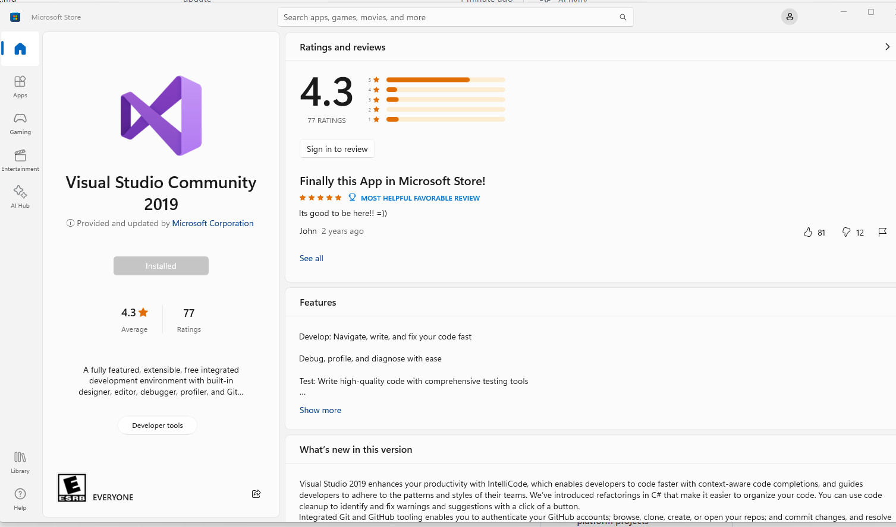
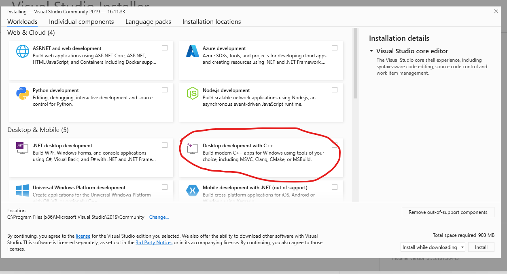

# Summit2024-Prework

This is for AE 2024 PFT Summit preparation: Software Development Workflows

All the attendees need to finish the prework by following this Readme.

1. Have MATLAB R2024a pre-release installed on your desktop

2. Create a GitHub Account by using your Mathworks email: https://github.com/ if you don't have an account

3. Download Git binary from Mathworks Software Center and install it if you don't have it

4. Use `git clone https://github.com/yuxudong1024/Summit2024-Prework` command to clone this repo

5. In the MATLAB command window, run `mex convet.c` to compile a mex file, if that fails, you need to install MATLAB compiler and Visual Studio 2019 if you didn't do so. You can download Visual Studio 2019 Community from Microsoft Store.  At the installation, please select the C++ support. After that, run 'mex -setup` to setup the comipile in MATLAB and make sure `mex convet.c` command works.

6. Fork this repo into your own account. 

7. Use git to clone your forked repo, and make some change at readme file. Use MATLAB to commit the change and push the change. 

8. This action will start a pop-up window in the browser to ask for your username and password for GitHub, after you type it, MATLAB will remember it and you don't need to type it anymore.