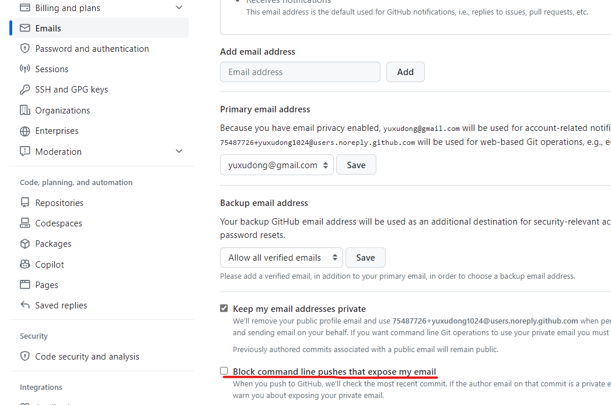
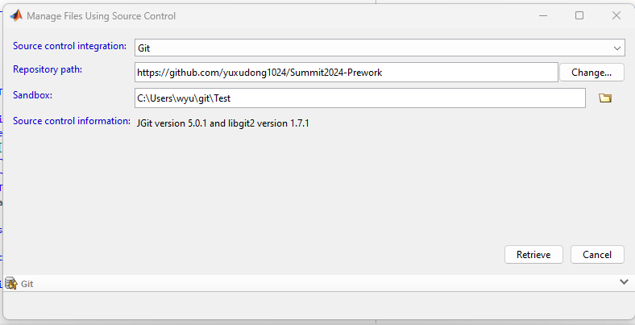
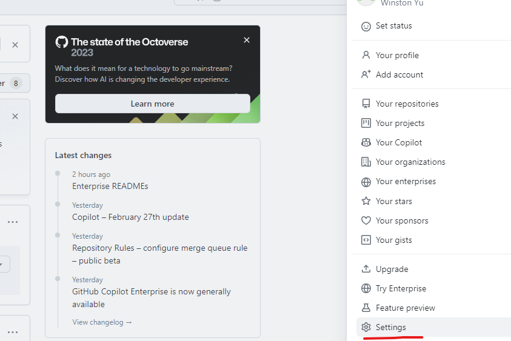
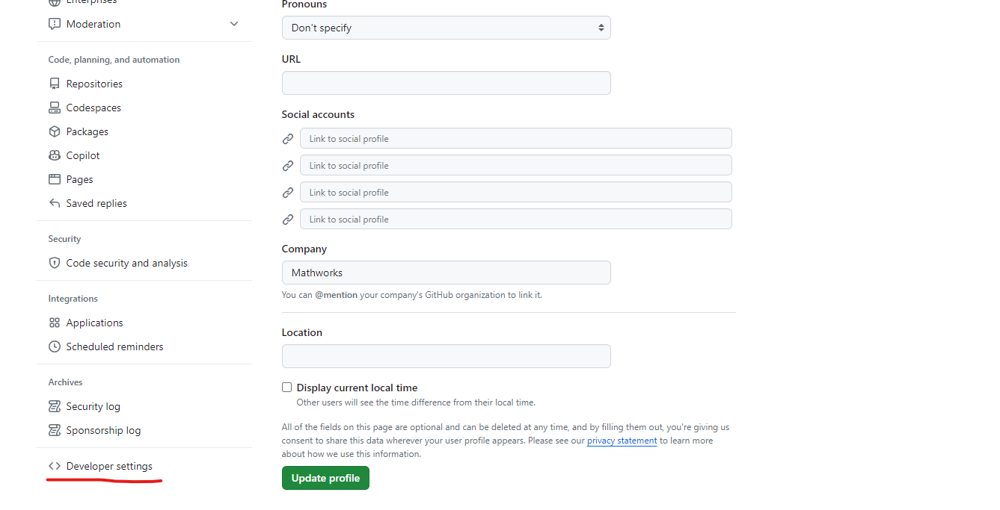
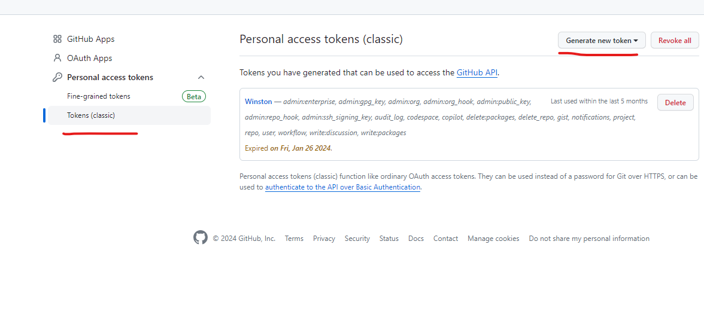

# Summit2024-Prework

Preperation for 2024 PFT Summit: **Software Development Workflows**

**Tutorial Requirements**

All steps need to be completed prior to the start of the tutorial held during the Summit.  Ensure you have all [Required Products](#required-products) installed before getting started.

**Note: This tutorial is built for Windows only**

**Getting Started**
1. Create a GitHub account (https://github.com) using your MathWorks email.  Click on your photo up in the right hand corner.  Click **Settings**.  On the left hands side, click **Emails**.  If the option exists, ensure that the GitHub email setting **Block command line pushes that expose my email** is not enabled.  
    

2. Fork this repo (https://github.com/yuxudong1024/Summit2024-Prework) into your own account
   

3. Click **Create fork**
   

   Save the URL of this forked repo (e.g., https://github.com/wyu/Summit2024-Prework) for later.
   
4. Start MATLAB R2024a.  Create a new folder in the `Current Folder` of MATLAB, name it Test and change the MATLAB directory to it.  Right click and select **Source Control > Manage Files...**
  

   Change **Repository path** to your forked repo (e.g., https://github.com/wyu/Summit2024-Prework)
   

   Click **Retrieve**.  MATLAB may prompt you for your GitHub account email and password.  Enter it and clone the repo.

5. From within MATLAB, make a small edit to this README file in your cloned repo.
   
6. From within MATLAB, commit the change.  Right click on README.md.  Click **Source Control > View and Commit Changes...**
   
   
7. Enter a Comment and then click **Commit**.

   

8. From within MATLAB, push the change.  Right click on README.md.  Click **Source Control > Push**
   
   

9. A pop-up window in a browser will prompt you for your username and password for GitHub.  After entering them, MATLAB will store it. If your GitHub account was set some time ago, you may get a notice that your username and password are mismatched.  Replace your password with a token, following these steps:

  * Click on your photo up in the right hand corner.  Click **Settings**
  

  * On the left hand side, click **Developer settings**
  

  * On the left hand side, click **Personal access tokens > Tokens (classic)**.  Click **Generate new token > Generate new token (classic)**
  

   Reauthenticate your GitHub account with your username and generated token.  Alternatively, you can store your credetials in a Git credential helper (e.g., Git Credential Manager Core).
   
***

## Required Products
1. **MATLAB R2024a pre-release** installed (without using the MATLAB New Desktop with Java Script)
2. **MATLAB Compiler**
   
3. **MATLAB Compiler SDK**
   
4. **MATLAB Test**
   
5. **C compiler** (e.g., MinGW, Visual Studio C/C++ compiler, etc.)
   

     Run `mex -setup` to setup the compiler in MATLAB.  Run `mex convec.c` to ensure you can compile MEX-files.
6. **Git** (e.g., from MathWorks Software Center)
   
